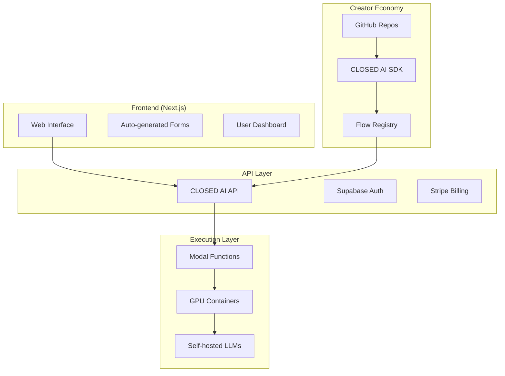

# CLOSED AI - Workflow Platform

> **Early Development Stage** - AI-powered workflow automation platform

⚠️ **Note**: This project is in **early development**. The frontend is functional, but many components are still being built.

## 🚀 Current Status

### ✅ **What's Working**
- **Frontend Application**: React/Vite app with modern UI (form-ai-runner/)
- **Demo Mode**: Run workflows without authentication
- **Workflow Engine**: Basic keyword clustering workflow
- **UI Components**: Modern design system with Tailwind + shadcn/ui
- **Supabase Integration**: Authentication and database setup

### 🚧 **In Development**
- Backend API integration
- Full monorepo structure
- Python/TypeScript SDKs
- Flow marketplace
- Creator economy features

## 📋 Quick Start

### Run the Frontend Locally

```bash
# Clone the repository
git clone https://github.com/federicodeponte/form-ai-runner.git
cd form-ai-runner

# Install dependencies
pnpm install

# Start development server
pnpm run dev
```

Visit **http://localhost:8080/flows/cluster-keywords** to try the demo workflow.

### Try the Live Demo

- **URL**: http://localhost:8080/flows/cluster-keywords
- **Demo Mode**: No signup required
- **Sample Workflow**: Keyword clustering with AI

## 🏗️ Architecture

### Current Implementation
```
closed-ai/
├── form-ai-runner/          # ✅ React frontend (working)
│   ├── src/components/      # UI components
│   ├── src/pages/          # Application pages
│   └── src/lib/            # Utilities and integrations
├── backend/                 # 🚧 FastAPI backend (basic setup)
├── supabase/               # 🚧 Database schema
└── packages/               # 🚧 SDK development (incomplete)
```

### Tech Stack
- **Frontend**: React 18 + Vite + TypeScript + Tailwind CSS
- **UI Library**: shadcn/ui + Radix UI
- **Backend**: Python FastAPI + Supabase
- **Database**: PostgreSQL (Supabase)
- **Auth**: Supabase Auth

## 🌟 Core Features (Implemented)

- **🎯 Workflow Execution** - Run AI workflows through web interface
- **💰 Cost Estimation** - See execution costs before running
- **🎨 Modern UI** - Clean, responsive design
- **🚀 Demo Mode** - Test workflows without signup
- **📱 Mobile Friendly** - Responsive design

## 🛠️ Development Setup

### Prerequisites
- Node.js 18+
- pnpm 8+
- Python 3.9+ (for backend)

### Frontend Development
```bash
cd form-ai-runner
pnpm install
pnpm run dev  # Starts on http://localhost:8080
```

### Backend Development (Optional)
```bash
cd backend
pip install -r requirements.txt
python run_server.py  # Starts on http://localhost:8000
```

## 📊 Project Status

| Component | Status | Priority |
|-----------|--------|----------|
| Frontend UI | ✅ Complete | - |
| Workflow Engine | ✅ Basic Demo | High |
| User Authentication | ✅ Setup Done | Medium |
| Backend API | 🚧 In Progress | High |
| Payment System | ❌ Not Started | Medium |
| SDK Development | 🚧 Basic Structure | Low |
| Documentation | 🚧 In Progress | Medium |

## 🗺️ Roadmap

### Phase 1: Core Platform (Current)
- [x] Frontend interface
- [x] Demo workflow
- [x] UI component system
- [ ] Backend API integration
- [ ] Real workflow execution

### Phase 2: User Features
- [ ] User authentication flow
- [ ] Payment integration
- [ ] Workflow library
- [ ] User dashboard

### Phase 3: Creator Economy
- [ ] Flow publishing system
- [ ] Revenue sharing
- [ ] SDK completion
- [ ] Documentation

## 🤝 Contributing

This is an early-stage project. Contributions are welcome!

### How to Help
1. **Frontend**: Improve UI/UX components
2. **Backend**: Build API endpoints
3. **Documentation**: Help document the codebase
4. **Testing**: Add test coverage

### Development Workflow
1. Fork the repository
2. Create a feature branch
3. Make your changes
4. Submit a pull request

## 📞 Contact

- **GitHub**: [federicodeponte/form-ai-runner](https://github.com/federicodeponte/form-ai-runner)
- **Issues**: Report bugs and feature requests on GitHub

---

**Early stage project** - Expect rapid changes and improvements! 🚀 
- **Every flow = One open source repo** - Complete transparency and collaboration
- **One global knowledge library** - Reusable components and functions
- **Simple frontend** - Input → Output, like n8n but easier
- **Fair creator economy** - 50/50 profit split with flow creators
- **Open source LLMs** - Hosted on German servers for privacy

## 📋 Table of Contents

- [Quick Start](#quick-start)
- [Architecture](#architecture)
- [Core Features](#core-features)
- [Development](#development)
- [Deployment](#deployment)
- [Contributing](#contributing)
- [Roadmap](#roadmap)
- [License](#license)

## ⚡ Quick Start

### For Users

1. **Visit the Platform**: Go to [closedai.com](https://closedai.com)
2. **Browse Flows**: Explore the flow library
3. **Run a Flow**: Input your data and get AI-powered results
4. **Pay Only for Usage**: Transparent, per-execution pricing

### For Developers

1. **Install the SDK**:
   ```bash
   # Python
   pip install closedai
   
   # TypeScript/JavaScript
   npm install @closedai/sdk
   ```

2. **Create Your First Flow**:
   ```bash
   closedai init my-awesome-flow
   cd my-awesome-flow
   ```

3. **Implement the Logic**:
   ```python
   from closedai import flow, llm_call
   
   @flow(gpu="l4")
   async def run(inputs):
       response = await llm_call(
           model_id="llama3-8b-q4",
           prompt=f"Analyze: {inputs['text']}"
       )
       return {"result": response.content}
   ```

4. **Deploy to CLOSED AI**:
   ```bash
   closedai deploy
   ```

## 🏗️ Architecture



### Key Components

- **Frontend**: Next.js 14 with auto-generated forms from flow specifications
- **Backend**: Python FastAPI with Supabase for auth and data
- **Execution**: Modal for serverless GPU containers
- **LLMs**: Self-hosted Llama, DeepSeek + external APIs (Claude, GPT, Gemini)
- **Storage**: PostgreSQL via Supabase, file storage for artifacts
- **Billing**: Stripe for credit purchases, usage-based charging

## 🌟 Core Features

### For Users
- **🎯 One-Click Execution** - Run any flow with a simple form
- **💰 Transparent Pricing** - See exact costs before running
- **🎛️ Model Selection** - Choose from 10+ AI models
- **📊 Usage Dashboard** - Track spending and execution history
- **🔒 Secure & Private** - EU-hosted LLMs, SOC2 compliance

### For Creators
- **📦 Easy Publishing** - GitHub repo → CLOSED AI flow
- **💸 Revenue Sharing** - 50/50 split on all executions
- **📈 Analytics** - Detailed usage and earnings insights
- **🛠️ Rich SDK** - Python & TypeScript support
- **🔄 Auto-deployment** - CI/CD with GitHub Actions

### For Businesses
- **🏢 Team Workspaces** - Collaborate on flows
- **🔌 API Access** - Integrate flows into your systems
- **📋 Usage Controls** - Spending limits and approvals
- **🎨 White-label** - Custom branding options

## 🛠️ Development

### Project Structure

```
closed-ai/
├── packages/
│   ├── sdk/
│   │   ├── python/           # Python SDK
│   │   ├── typescript/       # TypeScript SDK & CLI
│   │   ├── schema/           # Flow schema definitions
│   │   └── data/             # LLM & GPU pricing data
│   ├── web/                  # Next.js frontend
│   └── infra/
│       └── modal/            # Modal deployment scripts
├── examples/
│   └── cluster-keywords/     # Example flow implementation
├── .github/
│   └── workflows/            # CI/CD pipelines
└── docs/                     # Documentation
```

### Tech Stack

#### Frontend
- **Framework**: Next.js 14 with App Router
- **Language**: TypeScript
- **Styling**: Tailwind CSS + shadcn/ui
- **State**: Zustand
- **Forms**: React Hook Form + Zod
- **Auth**: Supabase Auth

#### Backend
- **Runtime**: Modal (serverless GPU functions)
- **API**: Python FastAPI
- **Database**: PostgreSQL (Supabase)
- **Auth**: Supabase
- **Billing**: Stripe
- **Queue**: Modal + Redis

#### AI/ML
- **Self-hosted**: Llama-3, DeepSeek (vLLM on German GCP)
- **External APIs**: OpenAI, Anthropic, Google
- **Inference**: Modal GPU containers (L4, A10G, A100)
- **Cost Tracking**: Per-second container + per-token LLM

### Local Development

1. **Clone the Repository**:
   ```bash
   git clone https://github.com/closedai/platform.git
   cd platform
   ```

2. **Install Dependencies**:
   ```bash
   # Install all packages
   npm install
   
   # Python SDK
   cd packages/sdk/python
   pip install -e .
   
   # TypeScript SDK
   cd ../typescript
   npm install
   npm run build
   ```

3. **Set Up Environment**:
   ```bash
   cp .env.example .env.local
   # Fill in your API keys and configuration
   ```

4. **Start Development Servers**:
   ```bash
   # Frontend (Next.js)
   cd packages/web
   npm run dev
   
   # Backend services would be deployed to Modal
   ```

## 🚀 Deployment

### Prerequisites

- **Modal Account**: For serverless GPU functions
- **Supabase Project**: For auth and database
- **Stripe Account**: For billing
- **Vercel Account**: For frontend hosting (optional)

### Environment Variables

```env
# API Keys
MODAL_TOKEN_ID=your_modal_token
MODAL_TOKEN_SECRET=your_modal_secret
SUPABASE_URL=your_supabase_url
SUPABASE_ANON_KEY=your_supabase_key
STRIPE_SECRET_KEY=your_stripe_key

# LLM APIs (optional)
OPENAI_API_KEY=your_openai_key
ANTHROPIC_API_KEY=your_anthropic_key
GOOGLE_API_KEY=your_google_key

# Infrastructure
CLOSEDAI_API_URL=https://api.closedai.com
CLOSEDAI_LLM_ENDPOINT=https://llm.closedai.com
```

### Deploy Command

```bash
# Deploy everything
npm run deploy

# Or deploy individually
npm run deploy:frontend
npm run deploy:backend
npm run deploy:flows
```

## 📊 Pricing

### For Users
- **Free Tier**: 100 credits (~$1 worth)
- **Pay-per-use**: Starting at $0.001 per execution
- **Volume Discounts**: Up to 50% off for high usage

### For Creators
- **50/50 Revenue Split**: Keep half of all execution fees
- **Monthly Payouts**: Via Stripe Connect
- **No Listing Fees**: Publish flows for free

### Model Pricing
| Model | Provider | Input ($/1K tokens) | Output ($/1K tokens) | Speed |
|-------|----------|-------------------|---------------------|--------|
| Llama-3-8B-Q4 | CLOSED AI | $0.0002 | $0.0002 | Fast ⚡ |
| Llama-3-70B-Q4 | CLOSED AI | $0.0008 | $0.0008 | Medium |
| Claude 3 Haiku | Anthropic | $0.25 | $1.25 | Fast ⚡ |
| GPT-4o Mini | OpenAI | $0.15 | $0.60 | Fast ⚡ |
| GPT-4o | OpenAI | $5.00 | $15.00 | Slow 🐌 |

## 🤝 Contributing

We welcome contributions! Please see our [Contributing Guide](CONTRIBUTING.md) for details.

### How to Contribute

1. **Report Issues**: Bug reports and feature requests
2. **Create Flows**: Publish useful automation flows
3. **Improve SDK**: Add features to Python/TypeScript SDKs
4. **Documentation**: Help improve our docs
5. **Code Review**: Review pull requests

### Development Workflow

1. Fork the repository
2. Create a feature branch
3. Make your changes
4. Add tests
5. Submit a pull request

## 🗺️ Roadmap

### Phase 1: MVP (Q1 2024) ✅
- [x] Core platform infrastructure
- [x] Python & TypeScript SDKs
- [x] Flow execution engine
- [x] Basic web interface
- [x] Creator revenue sharing

### Phase 2: Growth (Q2 2024)
- [ ] Flow marketplace & discovery
- [ ] Advanced analytics dashboard
- [ ] Team collaboration features
- [ ] API access for enterprises
- [ ] Mobile app (React Native)

### Phase 3: Scale (Q3-Q4 2024)
- [ ] Visual flow builder
- [ ] Webhook integrations
- [ ] Custom model hosting
- [ ] Enterprise features
- [ ] International expansion

### Phase 4: Innovation (2025)
- [ ] AI-powered flow optimization
- [ ] Multi-modal flows (vision, audio)
- [ ] Real-time collaborative editing
- [ ] Advanced monitoring & alerting
- [ ] Custom infrastructure options

## 🏆 Success Metrics

- **Flows Created**: 1,000+ by end of 2024
- **Monthly Executions**: 100K+ by Q4 2024
- **Creator Earnings**: $100K+ distributed in Year 1
- **User Satisfaction**: 4.8+ stars average rating

## 🤔 FAQ

### For Users

**Q: How much does it cost to run a flow?**
A: Costs vary by flow complexity and model used. Most simple flows cost $0.01-0.10, with real-time estimates shown before execution.

**Q: Can I run flows at scale?**
A: Yes! Use our API for batch processing and enterprise features for team collaboration.

**Q: What models are available?**
A: We offer 10+ models including self-hosted Llama/DeepSeek and API access to GPT, Claude, and Gemini.

### For Creators

**Q: How do I publish a flow?**
A: Create a GitHub repo with `flow.json` and your implementation, then use `closedai publish` command.

**Q: When do I get paid?**
A: Monthly payouts via Stripe Connect, with 50/50 revenue split on all executions.

**Q: Can I update my flows?**
A: Yes! Push updates to your GitHub repo and they'll auto-deploy with versioning.

## 📄 License

This project is licensed under the MIT License - see the [LICENSE](LICENSE) file for details.

## 🙏 Acknowledgments

- **Modal**: For amazing serverless GPU infrastructure
- **Supabase**: For auth and database services
- **The Open Source Community**: For inspiration and contributions
- **Our Beta Users**: For feedback and early adoption

## 📞 Contact

- **Website**: [closedai.com](https://closedai.com)
- **Documentation**: [docs.closedai.com](https://docs.closedai.com)
- **Discord**: [discord.gg/closedai](https://discord.gg/closedai)
- **Email**: [team@closedai.com](mailto:team@closedai.com)
- **Twitter**: [@ClosedAI](https://twitter.com/ClosedAI)

---

**Ready to build the future of AI automation?** 🚀

[Get Started](https://closedai.com/get-started) | [View Examples](examples/) | [Read Docs](https://docs.closedai.com) 